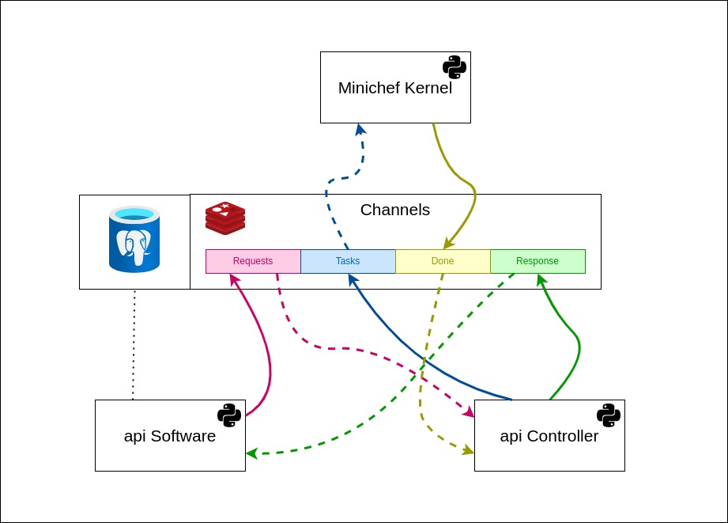

# **Minichef autofeeder (now with raspberry)**

For the final solution we will continue to use esp32 as hardware, however we decided to try the raspberry pi model b+ to test the performance of our solution.

For those who just want to use the code, just read the next section, for those who want to understand a little more how the solution works, read the entire README.

## **Install dependences**
Into Home folder our developers left a script to make your life easier, everything you have to do and run it with the following command:

``` 
./install.sh
```
## **Architecture**

The solution sought a simple architecture with good security, for that we chose to encapsulate the hardware control to a kernel, an api to request changes in the device as well as request data, and a control interface so that the api does not access it directly the kernel.
All these services communicate over redis using pub /sub.



Redis serves as a messaging service between services, however it does not generate a big delay since we are using pub / sub system, in addition we can make the services work in parallel avoiding long waiting times for the client when requesting data or configure your device.

## **Services**
### **API Software**
A simple api made with sonic for easy understanding of people less familiar with the subject.

#### [GET]  /sensors:
This route returns all the data from our sensors:
- temperature: in degrees celsius.
- Relative humidity: in percentage.
- Food weight in 'plate': in grams.

here we have an example of a response from this route:

```json
{
    "temperature":23,
    "humidity":58,
    "plate":128
}
```
#### [GET]  /sensors/< sensor >:
This route returns individual the data from our sensors:
- /sensors/temperature : return current temperature in degrees celsius.
- /sensors/humidity : return current relative humidity in percentage.
-  /sensors/palte : return current food weight in grams.

here we have an example of a response from this routes:

```json
// /sensors/temperature
{
    "data":15,
}
// /sensors/humidity
{
    "data":70,
}
// /sensors/plate
{
    "data":230,
}
```

#### [POST]  /config/< action >:
we are still implementing this route, it is used to configure the animal's meals as amount of feed and interval between meals.

#### **API Controller**
As we would like a secure solution, we chose to develop this service, so we can filter the client's request according to our security requirements and our business rules.

In case you still don't understand why the software api can't just directly access the kernel, we help you with some examples:

- What would happen if a malicious person requests that the animal's meal should be 10 kilos?
- What would happen if a malicious person requests all of an animal's data?
- What would happen if a malicious person sets up meals every 10 seconds?

You sure understand now why we should have this mediator between the kernel and the client.

#### **Kernel**

Nothing groundbreaking here, but if you're a newbie in this wonderful world of hardware, you'll surely wonder why we use oop instead of programming directly.

if you have this doubt even though you are more advanced, don't worry, because this is not something intuitive, when using oop we can abstract something real, such as a sensor, motor, receiver, transmitter, etc.

This abstraction makes handling these components much easier and more intuitive, in addition to taking up less code space and in many cases memory space!

In case you have never learned or don't worry, here are some links for your learning:
- https://www.geeksforgeeks.org/python-oops-concepts/

- https://en.wikipedia.org/wiki/Object-oriented_programming